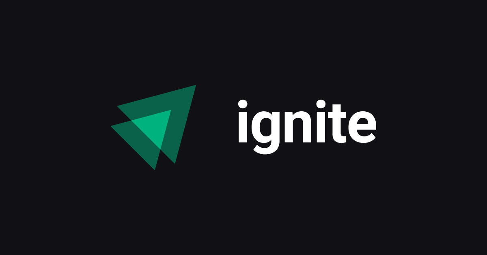

<div align="center">
  
</div>

<h1 align="center">
  Ignite Lab - 04 - Nest.JS
</h1>

<div align="center">
  

  
  	
  <a href="https://github.com/vspirandeli/rocketseat-ignite-lab-04-microservice-messaging/commits/master">
    
  </a>

  <!-- 
   <a href="https://github.com/vspirandeli/rocketseat-ignite-lab-04-microservice-messaging/stargazers">
    
  </a> -->
</div>

<h2>
  Sobre este projeto
</h2>

Este projeto foi do ignite lab, turma 4 que utilizou o framework <a href="https://github.com/nestjs/nest" target="_blank">Nest.JS</a> para a construção de um microserviço utilizando <a target="_blank" href="https://kafka.apache.org">Apache Kafka</a> para serviço de mensageria.
Foi desenvolvido apenas uma entidade para o projeto: <b>Notifications</b>.

Este projeto foi divido em 2 (duas) partes/ pastas. 
  - Backend: Contendo todo o backend e código principal do projeto.
  - Producer: Contendo um código Javascript para envio de mensageria.

<h2>
  Pré-requisitos
</h2>

Você vai precisar ter instalado na sua máquina as seguintes ferramentas:
- Versionador de software: [Git](https://git-scm.com).
- Interpretador Node: [Node.js](http://nodejs.org).
- Gerenciador de pacotes [Yarn](https://yarnpkg.com).
- Editor: [VSCode](https://code.visualstudio.com/).

Além dos programas acima foi utilizado o serviço de Kafka do site <a target="_blank" href="https://upstash.com">upstash</a>. Então é necessário a criação de uma conta, grátis, para o total funcionamento.

<div style="display: flex; align-items: center; flex-wrap: wrap;" id="criar-conta-kafka">
  Crie a conta, Faça login, abra a haba KAFA no header.
  Crie um cluster Kafka.<br />
  Anote o <i>Topic Name</i> na criação da conta. Como demonstrado na imagem:
  
  
</div>
<br />

<div>
  Após criado a conta abra o painel do kafka nos botões de <i>Connect to your cluster</i>, selecione <i>Node</i> o painel vai carregar um card contendo as informações de login

  
</div>
<br />

<div id="copiar-dados">
  Após selecionar <i>Node</i> vai abrir um card com as instruções de instaciação do kafka. Copie os seguintes dados:
    - brokers.
    - sasl:
      - mechanism.
      - username.
      - password.
    - ssl.<br/>
  E salve eles em um arquivo. Esses dados serão necessários dentro dos arquivos <i>.env</i> do projeto.
  <br />

  <b>OBS: O campo password deve ser copiado do menu que fica acima. Menu que contém: Region, Endpoint, Username e Password.</b>

  
</div>

<h2>
  Como executar esse projeto
</h2>
Como dito anteriormente este projeto está divido em duas partes. E para ambas as partes é necessário configurar o arquivo <i>.env</i>. 
<br />
Devemos criar uma cópia do arquivo <i>.env.example</i> contido em cada pasta do projeto, para a raiz de suas respectivas pastas com o nome de: <i>.env</i>.
Abaixo segue um tutorial.

```bash
# Já na pasta onde o projeto será clonado....
# Clonando este projeto
$ git clone https://github.com/vspirandeli/rocketseat-ignite-lab-04-microservice-messaging.git

# Copie e renomei o arquivo .env.example
$ cp backend/.env.example backend/.env && cp producer/.env.example producer/.env
```
<br />

No procedimento <a href="#criar-conta-kafka">anterior</a> foi criado um arquivo contendo os <a href="#copiar-dados">dados</a> do servidor kafka (upstesh). Esses dados devem ser colocados neste arquivo, recém criado <i>.env</i>. Respeitando as variáveis.

<br />
Após copiado e configrado os arquivos <i>.env</i> vá para cada pasta e instale as dependências e rode o projeto.

``` bash
# Navegue para a pasta backend e instale as dependências.
$ cd backend && yarn

# Faça o mesmo com a pasta producer.
$ cd ../producer && yarn
```
<br />

Para rodar o projeto em modo desenvolvimento:
```bash
# Navegue até a pasta backend
$ cd backend

# Inicie o projeto em modo desenvolvimento.
$ yarn start:dev
```
<br />

Executando o passo acima, se tudo ocorrer bem seu backend vai iniciar e aguardar que alguma mensagem seja enviada pelo kafka.<br />
Agora vamos enviar uma mensagem pelo kafka.

```bash
# Navegue até a pasta producer
$ cd producer

# Envie uma mensagem pelo kafka
$ node producer.js
```
<br />

Se tudo ocorrer bem o backend irá receber a mesnsagem.


<!-- VAR -->
[this.repo]: vspirandeli/rocketseat-ignite-lab-04-microservice-messaging